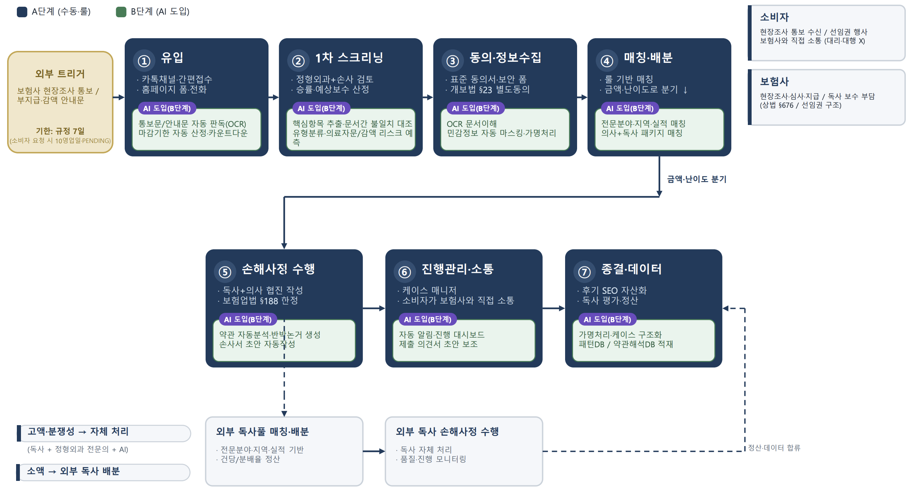

### [참고 자료]

- 실제 독립손해사정사 인터뷰
    
    [케이스별 업무 흐름 메모.pdf](./case_qna.pdf)
    
- 가명 처리된 독립손해사정사 종결 케이스
    
    [기왕증 케이스](./POC/기왕증·퇴행성%20기여도로%20감액된%20케이스/)  
    [약관상 지급범위 놓고 다툰 케이스](./POC/약관상%20지급범위)
    [후유장애 케이스](./POC/후유장해%20케이스/)

<aside>
💡

### 스크리닝 → 약관 매핑 → 반박 포인트 → 손사서 초안 Agent Harness PoC

**목표:** 모델을 새로 학습하지 않고, 기존 OCR/LLM/검색 모델을 조합한 Agent Harness를 구축하여 독립손해사정사 종결 케이스의 원자료만으로 ① 1차 스크리닝, ② 청구담보·감액사유 분류, ③ 약관 조항 매핑, ④ 반박 포인트 생성, ⑤ 손해사정서 초안 생성을 검증한다.

**NOTE:** 이번 PoC의 우선순위는 ② 1차 스크리닝과 ⑤ 손해사정 수행이며, ① 유입·④ 매칭·⑥ 진행관리는 A단계 수동 운영으로 충분하다고 정리되어 있다.

</aside>

# 0. PoC 정의

## 0.1 PoC 한 줄 정의

가명처리된 종결 케이스 원자료를 넣으면, Agent Harness가 스크리닝 리포트와 손해사정서 초안 v1을 생성하고, 이를 실제 최종 손사서와 비교 평가하는 3주 실험.

---

## 0.2 이번 PoC의 핵심 질문

1. 기존 모델만으로 보험 청구 관련 문서를 구조화할 수 있는가?
2. 청구담보와 감액사유를 실무적으로 쓸 만한 수준으로 추출할 수 있는가?
3. 문서 간 불일치와 핵심 쟁점을 잡아낼 수 있는가?
4. 약관 조항 후보를 찾아 손사 검토의 출발점으로 쓸 수 있는가?
5. 감액사유별 반박 포인트와 손사서 초안이 실제 업무 시간을 줄여주는가?

## 0.3 PoC 입력과 정답지 구분

# 1. 3주 PoC 범위

## 1.1 포함 범위

| 구분 | 사용 방식 | 예시 |
| --- | --- | --- |
| **모델 Input** | 모델이 분석하는 자료 | 보험증권, 약관, 진단서, 의무기록, 영상판독지, 영수증, 보험사 안내문 |
| **모델 Output** | Agent Harness가 생성 | 추출 항목, 사건 유형, 청구담보, 감액사유, 약관 매핑, 반박 포인트, 손사서 초안 |
| **정답지** | 모델에는 숨기고 평가에만 사용 | 바른결 최종 손해사정서, 실제 지급/감액 회복 결과 |
| **전문가 평가** | 정성 평가 | 김태윤 손사, 이요한 교수 리뷰 |

이번 3주 PoC에서는 아래 기능까지만 만든다.

| 우선순위 | 기능 | 설명 |
| --- | --- | --- |
| P0 | OCR/텍스트 추출 | PDF·이미지에서 텍스트 추출 |
| P0 | 문서 유형 분류 | 진단서, 의무기록, 약관, 안내문 등 구분 |
| P0 | 핵심항목 추출 | 진단명, KCD, 사고일, 치료기간, 수술명 등 |
| P0 | 청구담보 추출 | 실손, 수술비, 진단비, 후유장해 등 |
| P0 | 부지급·감액사유 추출 | 기왕증, 약관 제한, 치료 필요성 부족 등 |
| P0 | 사건 유형 분류 | 후유장해, 진단·수술비, 배상책임, 실손 등 |
| P1 | 문서 간 불일치 탐지 | 날짜, 진단명, 사고경위, 치료기간 불일치 |
| P1 | 약관 조항 후보 매핑 | 관련 약관 조항 list 제시 |
| P1 | 반박 포인트 생성 | 감액사유별 반박 논거 후보 생성 |
| P1 | 손사서 초안 구조 생성 | 개요, 쟁점, 약관, 의학, 산정, 결론 섹션 |
| P1 | 손사서 초안 v1 작성 | 전문가 검수용 초안 생성 |

## 1.2 제외 범위

3주 안에 아래는 하지 않는다.

| 제외 항목 | 제외 이유 |
| --- | --- |
| 신규 모델 학습 / 파인튜닝 | 이번 PoC는 existing model + harness 검증 |
| 승률 예측 | 라벨 데이터와 검증 기간 부족 |
| 예상보험금 산정 | 법적·실무 리스크 큼 |
| 장해율 자동 산정 | 의료·손사 전문 판단 필요 |

# 2. Agent Harness 구조 (예시)

## 2.1 전체 파이프라인

```
Case Pack 입력
↓
1. Document Intake Agent
↓
2. OCR / Text Extraction Layer
↓
3. Redaction Agent
↓
4. Document Classification Agent
↓
5. Field Extraction Agent
↓
6. Claim Coverage Agent
↓
7. Denial / Reduction Reason Agent
↓
8. Consistency Check Agent
↓
9. Case Type Classification Agent
↓
10. Policy Mapping Agent
↓
11. Rebuttal Point Agent
↓
12. Draft Writer Agent
↓
13. Evidence Check / Critic Agent
↓
14. Evaluation Harness
```

## 2.2 Agent별 역할

| Agent | 역할 | 주요 출력 |
| --- | --- | --- |
| Document Intake Agent | 케이스 파일 수집·정렬 | 문서 목록 |
| OCR Layer | PDF/이미지 텍스트화 | 문서별 raw text |
| Redaction Agent | 민감정보 제거 | 가명처리 텍스트 |
| Document Classification Agent | 문서 유형 분류 | 진단서/약관/안내문 등 |
| Field Extraction Agent | 핵심항목 추출 | 진단명, KCD, 사고일 등 |
| Claim Coverage Agent | 청구담보 식별 | 실손, 수술비, 후유장해 등 |
| Denial Reason Agent | 감액·부지급 사유 추출 | 기왕증, 약관 제한 등 |
| Consistency Check Agent | 문서 간 불일치 탐지 | 불일치 플래그 |
| Case Type Agent | 사건 유형 분류 | 후유장해/실손/수술비 등 |
| Policy Mapping Agent | 약관 조항 후보 탐색 | 약관 조항 리스트 |
| Rebuttal Agent | 반박 포인트 생성 | 반박 논거 후보 |
| Draft Writer Agent | 손사서 초안 생성 | draft_report.md |
| Critic Agent | 근거 없는 주장 탐지 | 검수 필요 표시 |
| Evaluation Harness | 실제 손사서와 비교 | 평가 리포트 |

# 3. 상세 일정

# Step 1. 데이터·OCR·스크리닝 뼈대 구축

## Step 1 목표

케이스 원자료를 넣으면 OCR, 가명처리, 문서 분류, 핵심항목 추출까지 end-to-end로 돌아가게 만든다.

---

## Step 1 핵심 산출물

| 산출물 | 완료 기준 |
| --- | --- |
| OCR 파이프라인 | 주요 문서 텍스트 추출 가능 |
| 문서 유형 분류 | 진단서/약관/안내문/의무기록 구분 |
| 핵심항목 JSON | 진단명, KCD, 사고일, 치료기간 등 구조화 |
| 기본 리뷰 화면 | 원문·OCR·추출값 확인 가능 |
| Dry Run | 케이스 입력부터 추출값 생성까지 완료 |

---

## 1.1 — Kickoff & 데이터 구조 확정

- [ ]  PoC 범위 최종 확정
- [ ]  폴더 구조 확정

---

### 1.2 — OCR / 텍스트 추출 파이프라인

- [ ]  PDF 텍스트 추출
- [ ]  이미지 OCR 연결
- [ ]  페이지 단위 텍스트 저장
- [ ]  문서별 OCR 품질 로그 생성
- [ ]  OCR 실패 문서 표시

---

### 1.3 — 문서 유형 분류

- [ ]  문서 유형 분류 프롬프트 작성
- [ ]  진단서, 의무기록, 약관, 안내문 등 분류
- [ ]  분류 confidence score 저장

---

### 1.4 — 핵심항목 추출 Agent

- [ ]  진단명 추출
- [ ]  KCD 추출
- [ ]  사고일 / 발병일 추출
- [ ]  수술명 추출
- [ ]  치료기간 추출
- [ ]  병원명 추출
- [ ]  보험사 안내문상 부지급/감액 표현 후보 추출

---

### 1.5 — Week 1 통합 Dry Run

- [ ]  end-to-end 실행
- [ ]  OCR → 가명처리 → 문서분류 → 핵심항목 추출 연결
- [ ]  리뷰 화면에서 원문과 추출값 비교
- [ ]  실패 케이스 유형 정리

---

## Step 1 종료 기준

- [ ]  end-to-end로 처리된다.
- [ ]  각 문서가 문서 유형별로 분류된다.
- [ ]  주요 핵심항목이 JSON으로 저장된다.
- [ ]  원문과 모델 추출 결과를 사람이 비교할 수 있다.

# Step 2. 1차 스크리닝 완성 + 약관 매핑 시작

## Step 2 목표

케이스별 스크리닝 리포트를 자동 생성하고, 청구담보·감액사유·사건유형·문서 간 불일치를 추출한다. 약관 조항 후보 매핑까지 시작한다.

---

## Step 2 핵심 산출물

| 산출물 | 완료 기준 |
| --- | --- |
| 청구담보 추출 Agent | 실손/수술비/진단비/후유장해 등 식별 |
| 감액사유 추출 Agent | 기왕증/약관제한/치료필요성 부족 등 분류 |
| 사건 유형 분류 Agent | 후유장해/진단·수술비/실손 등 분류 |
| 문서 간 불일치 Agent | 날짜, 진단명, 경위 불일치 탐지 |
| 약관 매핑 Agent | 관련 약관 조항 후보 리스트 초안 |
| 중간 데모 | 케이스 입력 → 스크리닝 리포트까지 시연 |

---

### 2.1 — 청구담보 추출 Agent

- [ ]  보험증권/약관/청구정보에서 담보 후보 추출
- [ ]  담보명 표준화
- [ ]  복수 담보 처리
- [ ]  청구담보 confidence score 부여
- [ ]  근거 문장 함께 저장

**출력 예시**

```
{
  "claim_coverages": [
    {
      "coverage_type":"상해후유장해",
      "confidence":0.86,
      "evidence":"보험증권 p.3 상해후유장해 담보 가입금액 1억원"
    },
    {
      "coverage_type":"실손의료비",
      "confidence":0.72,
      "evidence":"진료비 영수증 및 실손 청구 안내문 존재"
    }
  ]
}
```

---

### 2.2 — 감액사유 / 부지급사유 추출 Agent

- [ ]  보험사 안내문에서 감액·부지급 문구 추출
- [ ]  감액사유 taxonomy 정의
- [ ]  기왕증, 장해율, 손해액, 약관제한, 치료 필요성, 서류 부족 등 분류
- [ ]  감액 금액 또는 지급 제외 금액 추출
- [ ]  근거 문장 저장

**감액사유 Taxonomy v1**

| 코드 | 감액사유 |
| --- | --- |
| R01 | 기왕증 / 기존 질환 기여도 |
| R02 | 장해율 과다 |
| R03 | 손해액 과다 |
| R04 | 약관상 지급요건 미충족 |
| R05 | 면책사항 |
| R06 | 치료 필요성 부족 |
| R07 | 과잉진료 / 비급여 적정성 |
| R08 | 서류 부족 |
| R09 | 동일 사유 재청구 |
| R99 | 기타 / 분류 불가 |

---

### 2.3 — 사건 유형 분류 + 문서 간 불일치 탐지

- [ ]  사건 유형 분류 프롬프트 작성
- [ ]  후유장해 / 진단·수술비 / 실손 / 배상책임 / 기타 분류
- [ ]  문서별 날짜 비교
- [ ]  진단명 불일치 탐지
- [ ]  사고경위 불일치 탐지
- [ ]  치료기간 불일치 탐지
- [ ]  불일치 심각도 점수화

**출력 예시**

```
{
  "case_type":"후유장해",
  "inconsistencies": [
    {
      "field":"accident_date",
      "doc_a":"진단서",
      "value_a":"2024-03-12",
      "doc_b":"보험사 안내문",
      "value_b":"2024-03-15",
      "severity":"medium",
      "review_required":true
    }
  ]
}
```

---

### 2.4 — 스크리닝 리포트 자동 생성

- [ ]  스크리닝 리포트 템플릿 확정
- [ ]  핵심항목, 청구담보, 감액사유, 사건유형 통합
- [ ]  부족서류 후보 생성
- [ ]  손사 검수 필요 포인트 표시
- [ ]  의사 검수 필요 포인트 표시

**스크리닝 리포트 템플릿**

```
# 스크리닝 리포트

## 1. 사건 개요
- 사건 ID:
- 사건 유형:
- 주요 진단명:
- 사고일 / 발병일:
- 치료기간:
- 주요 청구담보:

## 2. 보험사 판단
- 부지급/감액 여부:
- 감액사유:
- 보험사 주장 요약:
- 감액금액 / 지급제외금액:

## 3. 핵심 쟁점
- 쟁점 1:
- 쟁점 2:
- 쟁점 3:

## 4. 문서 간 불일치
- 날짜 불일치:
- 진단명 불일치:
- 사고경위 불일치:
- 치료기간 불일치:

## 5. 추가 필요 서류
- 필요 서류:
- 요청 사유:

## 6. 전문가 검수 포인트
- 손사 검수 필요:
- 의사 검수 필요:

## 7. 1차 판단
- 진행 가능성:
- 난이도:
- 우선 검토 포인트:
```

---

### Day 10 — 약관 매핑 v0 + 중간 데모

- [ ]  약관 텍스트 chunking
- [ ]  담보명 기반 조항 후보 검색
- [ ]  감액사유 기반 조항 후보 검색
- [ ]  약관 조항 리스트 반환
- [ ]  근거 문장 표시
- [ ]  중간 데모 준비

**중간 데모 시나리오**

1. 케이스 폴더 선택
2. 문서 목록 확인
3. OCR/가명처리 결과 확인
4. 핵심항목 추출 결과 확인
5. 청구담보 확인
6. 감액사유 확인
7. 사건 유형 확인
8. 문서 간 불일치 확인
9. 스크리닝 리포트 생성
10. 약관 조항 후보 확인

---

## Step 2 종료 기준

- [ ]  스크리닝 리포트가 자동 생성된다.
- [ ]  청구담보와 감액사유가 구조화 JSON으로 저장된다.
- [ ]  사건 유형 분류 결과가 나온다.
- [ ]  문서 간 불일치가 최소한 날짜·진단명 기준으로 탐지된다.
- [ ]  약관 조항 후보 리스트가 생성된다.
- [ ]  중간 데모가 가능하다.

# Step 3. 반박 포인트 + 손사서 초안 + 평가

## Step 3 목표

**약관 매핑과 감액사유를 바탕으로 반박 포인트를 생성하고, 검수용 손사서 초안 v1을 만든 뒤, 실제 독립사정사 최종 손사서와 비교 평가한다.**

## Step 3 핵심 산출물

| 산출물 | 완료 기준 |
| --- | --- |
| 반박 포인트 Agent | 감액사유별 반박 논거 후보 생성 |
| 의료 검수 포인트 | 의사 검토 필요 항목 표시 |
| 손사서 구조 Agent | 사건 유형별 목차 자동 생성 |
| 손사서 초안 Agent | 초안 생성 |
| Critic Agent | 근거 없는 문장·추정 표현 표시 |
| 평가 Harness | 최종 손사서와 항목별 비교 |
| 최종 데모 | 전체 플로우 시연 |

## 3.1 — 반박 포인트 Agent

- [ ]  감액사유별 반박 프레임 정의
- [ ]  약관 조항과 감액사유 연결
- [ ]  의무기록 근거 연결
- [ ]  반박 논거 후보 생성
- [ ]  근거 없는 반박은 “검수 필요” 처리
- [ ]  케이스별 반박 포인트 리포트 생성

**반박 포인트 출력 예시**

```
# 반박 포인트

## 감액사유
- 치료 필요성 부족

## 보험사 주장
- 도수치료 횟수가 과도하고 의학적 필요성이 부족하다는 취지

## 반박 후보
1. 의무기록상 통증 지속 및 기능 제한 기록이 확인됨
2. 진단서상 보존적 치료 필요성이 기재되어 있음
3. 치료기간과 증상 경과가 단절 없이 이어짐

## 근거 자료
- 의무기록 p.4: 통증 지속 기록
- 진단서 p.1: 진단명 및 치료 필요성
- 영수증 p.2: 치료일자

## 검수 필요
- 치료 횟수의 적정성은 정형외과 전문의 검수 필요
```

---

### 3.2 — 손사서 구조 Agent + Draft Writer v0

- [ ]  사건 유형별 손사서 목차 템플릿 정의
- [ ]  후유장해형 템플릿
- [ ]  실손/비급여형 템플릿
- [ ]  진단·수술비형 템플릿
- [ ]  스크리닝 결과 → 손사서 구조로 변환
- [ ]  초안 본문 생성 v0

**손사서 초안 기본 구조**

```
# 손해사정서 초안

## 1. 사건 개요
- 피보험자:
- 사고일 / 발병일:
- 진단명:
- 청구담보:
- 청구 경위:

## 2. 관련 자료
- 진단서:
- 의무기록:
- 영상판독지:
- 보험증권:
- 약관:
- 보험사 안내문:

## 3. 주요 쟁점
- 쟁점 1:
- 쟁점 2:
- 쟁점 3:

## 4. 약관 검토
- 관련 담보:
- 관련 약관 조항:
- 지급요건:
- 보험사 적용 논리:

## 5. 의학적 검토
- 진단 및 치료 경과:
- 의무기록상 확인사항:
- 의학적 쟁점:
- 의사 검수 필요사항:

## 6. 감액/부지급 사유에 대한 검토
- 보험사 주장:
- 반박 논거:
- 근거 자료:

## 7. 손해사정 의견
- 인정 가능성:
- 추가 확인 필요 사항:
- 결론 방향:

## 8. 첨부 및 근거
- 근거 문서 목록:
- 검수 필요 문장:
```

---

### 3.3 — Evidence Check / Critic Agent

- [ ]  초안 문장별 근거 문서 연결
- [ ]  근거 없는 주장 탐지
- [ ]  과도한 법률 판단 표현 탐지
- [ ]  과도한 의료 확정 표현 탐지
- [ ]  “검수 필요” 태그 추가
- [ ]  최종 초안 v1 생성

**금지 표현 예시**

| 위험 표현 | 대체 표현 |
| --- | --- |
| “보험사는 반드시 지급해야 한다” | “지급 가능성을 검토할 여지가 있다” |
| “의학적으로 명백하다” | “의무기록상 해당 가능성이 확인되며, 전문의 검수가 필요하다” |
| “약관상 부당하다” | “해당 약관 적용의 적정성에 대한 검토가 필요하다” |
| “승소 가능성이 높다” | “분쟁 대응 여지가 있다” |

---

### 3.4 — 평가 Harness 구축

- [ ]  최종 손사서와 모델 초안 비교 항목 정의
- [ ]  핵심항목 추출 정확도 계산
- [ ]  사건 유형 분류 정확도 계산
- [ ]  감액사유 일치율 계산
- [ ]  약관 매핑 Top-3 포함 여부 계산
- [ ]  손사서 초안 품질 루브릭 입력 화면 생성
- [ ]  손사/의사 리뷰 결과 저장

**평가 지표**

| 평가 항목 | 평가 방식 |
| --- | --- |
| 핵심항목 추출 | 필드별 정답 일치율 |
| 청구담보 추출 | 정답 담보 포함 여부 |
| 감액사유 추출 | Top-1 / Top-3 일치율 |
| 사건 유형 분류 | 분류 정확도 |
| 문서 간 불일치 | 전문가가 중요하다고 본 불일치 탐지 여부 |
| 약관 조항 매핑 | 관련 조항 Top-3 포함 여부 |
| 반박 포인트 | 손사 평가 1~5점 |
| 의료 포인트 | 의사 평가 1~5점 |
| 손사서 초안 | 실제 수정 가능한 수준인지 평가 |
| 시간 절감 | 기존 작성 시간 대비 예상 절감률 |

---

### 3.5 — 최종 데모

**최종 데모 시나리오**

1. 케이스 선택
2. 원자료 목록 확인
3. OCR/가명처리 결과 확인
4. 문서 유형 분류 결과 확인
5. 핵심항목 추출 결과 확인
6. 청구담보 확인
7. 감액사유 확인
8. 사건 유형 확인
9. 문서 간 불일치 확인
10. 약관 조항 후보 확인
11. 반박 포인트 확인
12. 손사서 초안 확인
13. Critic Agent의 검수 필요 표시 확인
14. 실제 최종 손사서와 비교
15. 평가 결과 확인

---

## Step 3 종료 기준

- [ ]  스크리닝 리포트가 최종 형태로 생성된다.
- [ ]  손사서 초안 v1이 생성된다.
- [ ]  약관 조항 후보 리스트가 생성된다.
- [ ]  감액사유별 반박 포인트가 생성된다.
- [ ]  전문가가 검수할 수 있는 리뷰 화면이 있다.
- [ ]  실제 최종 손사서와 비교한 평가 리포트가 있다.

# 4. 성공 기준

## 4.1 정량 기준

| 항목 | 3주 PoC 목표 |
| --- | --- |
| 핵심항목 추출 정확도 | 80% 이상 |
| 청구담보 추출 정확도 | 75% 이상 |
| 감액사유 Top-3 일치율 | 75% 이상 |
| 사건 유형 분류 정확도 | 80% 이상 |
| 약관 조항 Top-3 포함률 | 60~70% 이상 |
| 손사서 초안 생성 성공률 | 70% 이상 |
| 케이스당 처리 시간 | 10분 이내 |

---

## 4.2 정성 기준

| 평가자 | 기준 |
| --- | --- |
| 김태윤 손사 | 쟁점이 실무적으로 맞는가 |
| 김태윤 손사 | 약관 매핑이 검토 출발점으로 쓸 만한가 |
| 김태윤 손사 | 반박 논리가 실제 손사서에 반영 가능한가 |
| 이요한 교수 | 의료적 표현이 과장되지 않았는가 |
| 이요한 교수 | 의무기록 기반 검수 포인트가 잘 잡혔는가 |

## 4.3 Go / No-Go 기준

### Go

아래 조건을 만족하면 다음 단계 진행.

- [ ]  스크리닝 리포트가 전문가 검토의 출발점으로 쓸 만하다.
- [ ]  청구담보·감액사유 추출이 대체로 맞다.
- [ ]  약관 매핑이 완벽하지 않아도 후보 추천으로 유용하다.
- [ ]  손사서 초안이 백지 작성보다 시간을 줄인다.
- [ ]  실패 유형이 명확하고 개선 가능하다.

### No-Go

아래 조건이면 범위를 재설계.

- [ ]  OCR 품질 때문에 문서 이해가 거의 불가능하다.
- [ ]  청구담보와 감액사유가 반복적으로 틀린다.
- [ ]  약관 매핑이 무작위 수준이다.
- [ ]  초안이 환각이 많아 검수 비용이 더 든다.
- [ ]  전문가가 “실무 보조도구로 사용하기 어렵다”고 평가한다.